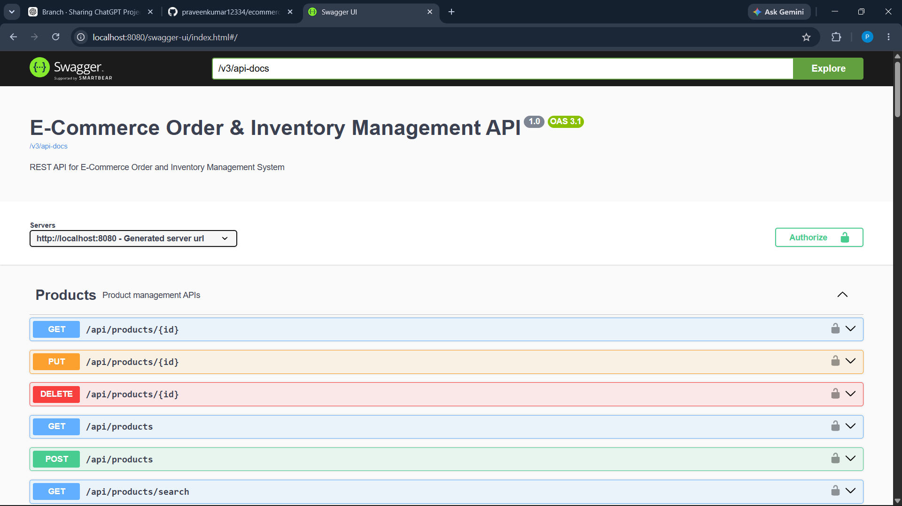

# E-commerce Order & Inventory Management System

A backend-focused E-commerce Order & Inventory Management System built using Java and Spring Boot. The application manages products, inventory, customers, shopping carts, orders, payments, deliveries, suppliers, and stock movements through secure REST APIs.

## 📸 API Documentation

The project provides interactive REST API documentation using Swagger UI.



## 🚀 Features

- Customer registration and JWT-based login
- Role-based access control
- Product and category management
- Supplier management
- Purchase order management
- Automatic inventory updates
- Stock movement tracking
- Shopping cart management
- Order creation and checkout
- Payment processing
- Order cancellation with stock restoration
- Delivery creation and tracking
- Address management
- Product reviews
- Low-stock detection
- Global exception handling
- Input validation
- Swagger/OpenAPI API documentation
- Secure password encryption using BCrypt

## 🛠️ Technologies Used

- Java 21
- Spring Boot
- Spring Framework
- Spring Security
- Spring Data JPA
- Hibernate
- MySQL
- REST APIs
- JWT
- Maven
- Thymeleaf
- Bean Validation
- Swagger / OpenAPI
- Postman
- Git & GitHub

## 🏗️ Architecture

The project follows a layered architecture:

```text
Client
   ↓
REST Controller
   ↓
Service Layer
   ↓
Repository Layer
   ↓
MySQL Database
````

## 👥 User Roles

### CUSTOMER

* Register and login
* Manage address
* Manage cart
* Place orders
* Make payments
* View own orders
* Cancel eligible orders
* Add product reviews

### ADMIN

* Manage products
* Manage categories
* Manage users
* Manage inventory
* Manage suppliers
* Manage purchase orders
* Monitor stock

### STAFF

* Manage assigned deliveries
* Update delivery status
* Perform permitted operational activities

## 📦 Main Business Flow

```text
Supplier
   ↓
Purchase Order
   ↓
Inventory
   ↓
Product
   ↓
Cart
   ↓
Order
   ↓
Payment
   ↓
Delivery
   ↓
Order Completed
```

## 📊 Inventory Management

The system maintains inventory for products and tracks stock changes through stock movements.

Examples of stock movements:

* PURCHASE_RECEIVED
* ORDER_PLACED
* ORDER_CANCELLED
* MANUAL_ADJUSTMENT

Business rules include:

* Stock cannot become negative
* Orders cannot exceed available stock
* Receiving a purchase increases inventory
* Placing an order decreases inventory
* Cancelling an eligible order restores inventory
* Low-stock products can be identified using a configurable threshold

## 🔐 Security

The application uses:

* JWT authentication
* BCrypt password encryption
* Role-based authorization
* Spring Security
* Method-level authorization using `@PreAuthorize`
* Protected REST endpoints
* Public access only for permitted endpoints

Passwords are not returned in API responses.

### Security Flow

```text
Client
   ↓
Login
   ↓
JWT Token
   ↓
JWT Authentication Filter
   ↓
Spring Security
   ↓
Role-Based Authorization
   ↓
Protected REST API
```

## 🧪 Testing

The project includes tests for:

* Controllers
* Services
* Repositories
* Security-related behavior
* Validation and exception handling
* Business rules

The complete test suite has been executed successfully.

## 📖 API Documentation

Swagger/OpenAPI is integrated into the application for API documentation and testing.

When the application is running:

```text
http://localhost:8080/swagger-ui/index.html
```

## ⚙️ Configuration

Create the MySQL database:

```sql
CREATE DATABASE ecommerce_db;
```

Configure the following environment variables before running the application:

```text
DB_PASSWORD
JWT_SECRET
```

Example PowerShell setup:

```powershell
$env:DB_PASSWORD="your_mysql_password"
$env:JWT_SECRET="your_long_jwt_secret"
```

Then start the application:

```powershell
.\mvnw.cmd spring-boot:run
```

## 🗄️ Database

The application uses MySQL with Spring Data JPA and Hibernate.

Major entities include:

* User
* Address
* Category
* Product
* Supplier
* PurchaseOrder
* PurchaseOrderItem
* Inventory
* StockMovement
* Cart
* CartItem
* Order
* OrderItem
* Payment
* Delivery
* Review
* OrderStatusHistory

## 🔄 Order Lifecycle

A typical order flow is:

```text
PLACED
   ↓
CONFIRMED
   ↓
SHIPPED
   ↓
DELIVERED
```

Eligible orders can be cancelled, with inventory restored according to the business rules.

## 📌 Project Highlights

* Layered Spring Boot architecture
* RESTful API design
* JWT authentication and authorization
* Role-based security
* JPA/Hibernate database integration
* Transaction management
* Inventory and stock tracking
* Order and payment workflow
* Delivery lifecycle management
* Global exception handling
* API validation
* Automated testing
* Swagger API documentation

## 👨‍💻 Author

**Praveen Kumar**

Java Developer | Spring Boot | Backend Development
